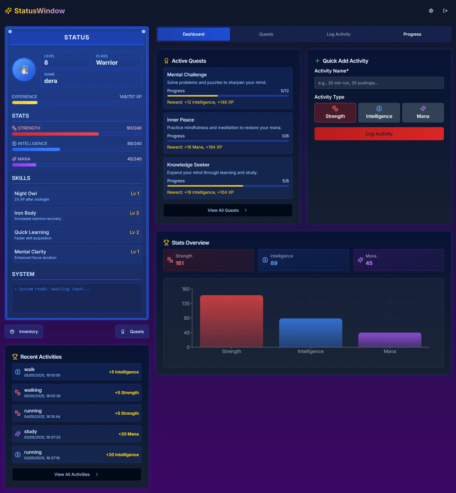
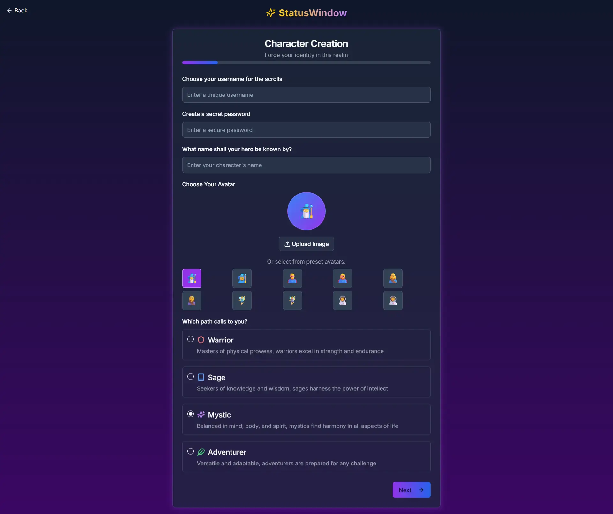
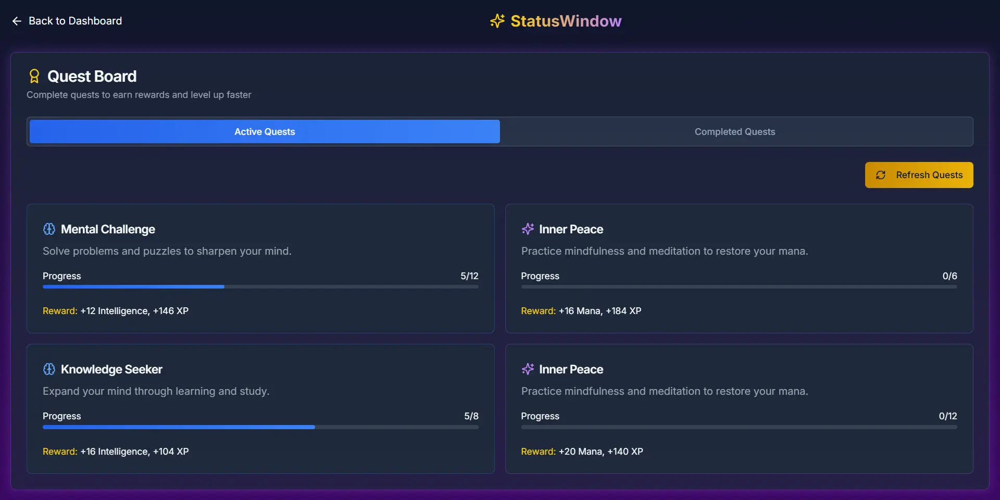
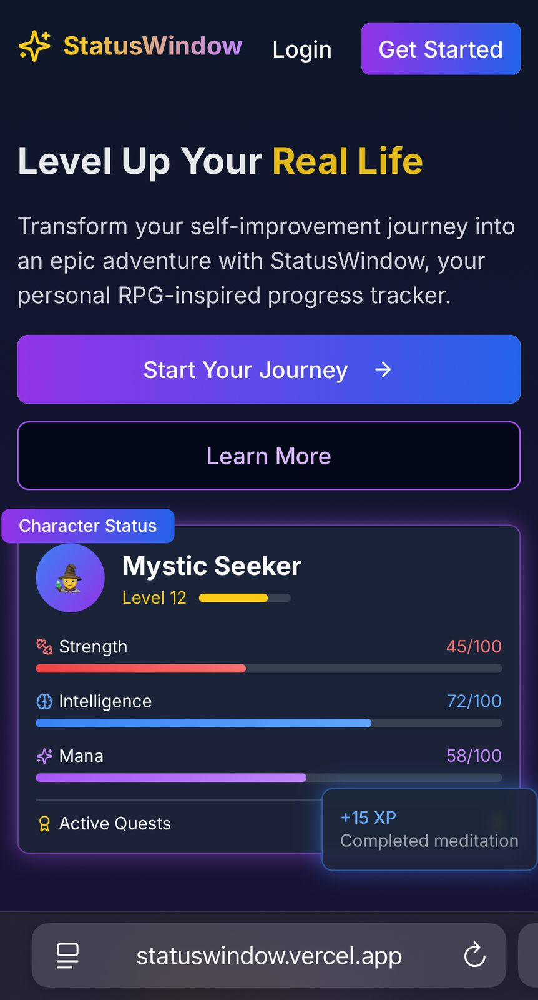

# StatusWindow

<p align="center">
  
</p>

<p align="center">
  A gamified self-improvement web application that turns your real-life activities into RPG-style progression.
</p>

<p align="center">
  <a href="#features">Features</a> •
  <a href="#demo">Demo</a> •
  <a href="#tech-stack">Tech Stack</a> •
  <a href="#architecture">Architecture</a> •
  <a href="#installation">Installation</a> •
  <a href="#usage">Usage</a> •
  <a href="#mobile-optimization">Mobile Optimization</a> •
  <a href="#future-development">Future Development</a>
</p>

## Features

StatusWindow transforms your daily activities into a gamified experience with:

- **Character Creation & Progression**: Create your character and level up as you complete real-life activities
- **Activity Logging System**: Log your daily activities and earn XP and stat points
- **Quest System**: Complete quests to earn rewards and track your progress
- **Inventory & Items**: Collect items as you progress through your journey
- **Progress Analytics**: Track your progress with detailed charts and statistics
- **Mobile-Optimized Experience**: Fully responsive design with touch gestures and mobile-specific features

## Demo

<div style="display: flex; flex-direction: column; gap: 2rem; margin: 2rem 0;">

  <!-- Dashboard Section -->
  <div style="display: flex; gap: 2rem; align-items: flex-start; margin-bottom: 3rem;">
    
    <div style="flex: 1;">
      <h3 style="margin-top: 0;">Main Dashboard</h3>
      <p>The central hub features your character's status window with real-time stat tracking, activity log, and quick-access controls.</p>
      <ul style="margin-top: 0.5rem; color: #666;">
        <li>Live stat tracking</li>
        <li>Recent activity feed</li>
        <li>Quick-log buttons</li>
      </ul>
    </div>
  </div>

  <!-- Character Creation Section -->
  <div style="display: flex; gap: 2rem; align-items: flex-start; margin-bottom: 3rem; flex-direction: row-reverse;">
    
    <div style="flex: 1;">
      <h3 style="margin-top: 0;">Character Creation</h3>
      <p>Create your RPG avatar with unique traits and initial stat allocations. Choose from various fantasy archetypes.</p>
      <ul style="margin-top: 0.5rem; color: #666;">
        <li>Class selection</li>
        <li>Stat distribution</li>
        <li>Avatar customization</li>
      </ul>
    </div>
  </div>

  <!-- Quests Section -->
  <div style="display: flex; gap: 2rem; align-items: flex-start; margin-bottom: 3rem;">
    
    <div style="flex: 1;">
      <h3 style="margin-top: 0;">Quest System</h3>
      <p>Track and complete daily challenges with RPG-style objectives and rewards.</p>
      <ul style="margin-top: 0.5rem; color: #666;">
        <li>Daily/Weekly challenges</li>
        <li>XP rewards system</li>
        <li>Progress tracking</li>
      </ul>
    </div>
  </div>

  <!-- Mobile View Section -->
  <div style="display: flex; gap: 2rem; align-items: center; margin-bottom: 3rem; flex-direction: row-reverse;">
    
    <div style="flex: 1;">
      <h3 style="margin-top: 0;">Mobile Experience</h3>
      <p>Fully responsive design optimized for mobile devices with touch-friendly controls.</p>
      <ul style="margin-top: 0.5rem; color: #666;">
        <li>Swipe gestures</li>
        <li>Condensed UI</li>
      </ul>
    </div>
  </div>

</div>

## Tech Stack

StatusWindow is built with modern web technologies:

- **Frontend Framework**: Next.js 14 (App Router)
- **UI Library**: React 18
- **Styling**: Tailwind CSS with custom animations
- **State Management**: React Context API
- **Data Persistence**: Browser localStorage
- **Animations**: CSS animations, Framer Motion
- **Icons**: Lucide React
- **Charts**: Recharts
- **Particle Effects**: tsParticles

## Architecture

### Project Structure

```
statuswindow/
├── app/                      # Next.js App Router
│   ├── activities/           # Activities page
│   ├── dashboard/            # Main dashboard
│   ├── login/                # Login page
│   ├── onboarding/           # Character creation
│   ├── profile/              # User profile
│   ├── progress/             # Progress analytics
│   ├── quests/               # Quest board
│   ├── globals.css           # Global styles
│   ├── layout.tsx            # Root layout
│   ├── page.tsx              # Landing page
│   └── status-animations.css # Animation styles
├── components/               # React components
│   ├── ui/                   # UI components (shadcn/ui)
│   ├── activity-form.tsx     # Activity logging form
│   ├── activity-verification.tsx # Activity verification
│   ├── avatar-upload.tsx     # Avatar upload component
│   ├── celebration-effect.tsx # XP gain celebration
│   ├── inventory-system.tsx  # Inventory management
│   ├── mobile-nav-drawer.tsx # Mobile navigation
│   ├── mobile-nav-wrapper.tsx # Mobile nav wrapper
│   ├── particles-background.tsx # Particle effects
│   ├── particles-wrapper.tsx # Particles wrapper
│   ├── progress-chart.tsx    # Progress visualization
│   ├── quest-board.tsx       # Quest display
│   ├── scroll-to-top.tsx     # Scroll to top button
│   └── status-window.tsx     # Main status display
├── hooks/                    # Custom React hooks
│   ├── use-mobile.tsx        # Mobile detection
│   └── use-swipe.tsx         # Swipe gesture detection
├── lib/                      # Utility libraries
│   └── quest-generator.tsx   # Quest generation logic
├── public/                   # Static assets
│   ├── sfx/                  # Sound effects
│   ├── textures/             # Texture images
│   └── images/               # Images and icons
├── utils/                    # Utility functions
│   └── audio.ts              # Audio playback utilities
└── next.config.js            # Next.js configuration
```

### Core Components

- **StatusWindow**: Displays character stats, level, and progress
- **ActivityForm**: Interface for logging completed activities
- **QuestBoard**: Displays available and completed quests
- **ProgressChart**: Visualizes progress over time
- **InventorySystem**: Manages collected items and rewards

### Data Flow

1. User logs an activity through the ActivityForm
2. ActivityVerification confirms the activity's completion
3. XP and stats are calculated and added to the user's profile
4. StatusWindow updates to reflect new stats
5. Progress is saved to localStorage
6. CelebrationEffect provides visual feedback
7. Quest progress is updated if applicable

## Installation

```bash
# Clone the repository
git clone https://github.com/yourusername/statuswindow.git

# Navigate to the project directory
cd statuswindow

# Install dependencies
npm install

# Start the development server
npm run dev
```

## Usage

Once installed and running, StatusWindow provides an intuitive interface:

1. **First-Time Setup**:
   - Create your character by selecting a class and distributing initial stat points
   - Set up your activity categories (e.g., Exercise, Reading, Coding)
   - Configure your daily goals

2. **Daily Use**:
   - Log activities as you complete them throughout the day
   - Check your quest board for daily challenges
   - Monitor your stat progression in the dashboard
   - Collect rewards for completed quests

3. **Long-Term Tracking**:
   - View your progress analytics to identify trends
   - Level up your character by earning XP
   - Unlock new items and abilities as you progress

## Mobile Optimization

StatusWindow is designed with mobile-first principles:

- **Touch-Friendly Controls**: Large buttons and swipe gestures for easy navigation
- **Responsive Layout**: Adapts to any screen size from phone to desktop
- **Mobile-Specific Features**:
  - Quick-log buttons for frequent activities
  - Offline support with localStorage persistence
- **Performance Optimizations**:
  - Lazy-loaded components
  - Optimized animations for mobile devices
  - Reduced bundle size for faster loading

## Future Development

Planned features and improvements:

### Short-Term Roadmap
- [ ] Social features (friends list, leaderboards)
- [ ] Achievement system with badges
- [ ] Customizable activity categories

### Long-Term Vision
- [ ] Mobile app versions (iOS/Android)
- [ ] Wearable device integration
- [ ] AI-powered quest generation
- [ ] Expanded character customization

## Contributing

We welcome contributions! Here's how to get started:

1. Fork the repository
2. Create a new branch for your feature (`git checkout -b feature/your-feature`)
3. Commit your changes (`git commit -m 'Add some feature'`)
4. Push to the branch (`git push origin feature/your-feature`)
5. Open a Pull Request

Please ensure your code follows the existing style and includes appropriate tests.

## License

StatusWindow is [MIT licensed](LICENSE).

## Support

For support, feature requests, or bug reports:
- Open an issue on GitHub

<p align="center">
  <a href="#statuswindow">Back to Top</a>
</p>

