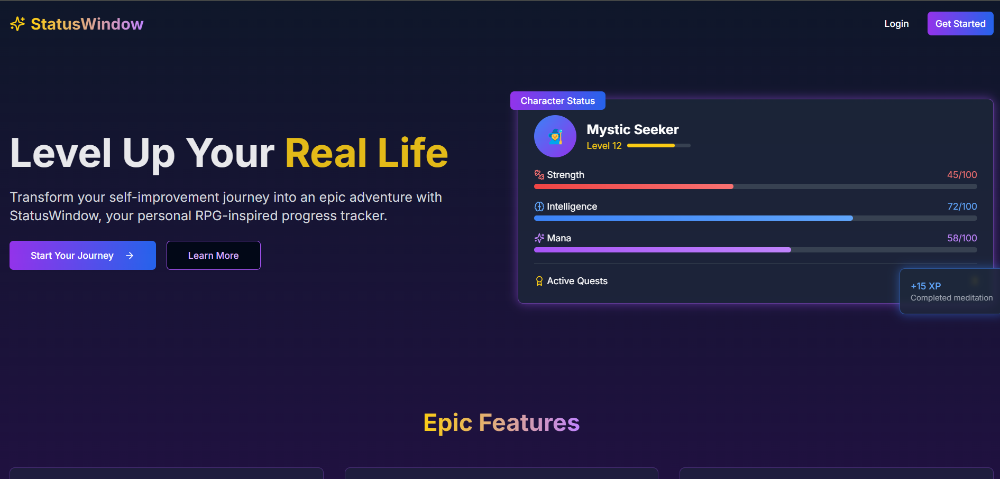

# Status Window - Solo Leveling Style RPG Tracker

<div align="center">
  
  <p><em>Turn your life into a manhwa RPG system</em></p>
</div>

## 🌟 Features
- **Authentic Solo Leveling UI** with stat windows
- **Core stats tracking**: STR • INT • MANA
- **XP system** with level progression
- **Daily quests** with rewards
- **Mobile-optimized** responsive design
- **Vercel-edge optimized** performance

## 🚀 Live Demo
[https://statuswindow.vercel.app](https://statuswindow.vercel.app)

## 🛠 Tech Stack
| Component | Technology |
|-----------|------------|
| Framework | Next.js 13 |
| Styling | Tailwind CSS |
| Animations | Framer Motion |
| Hosting | Vercel |

## 🛠 Installation
```bash
git clone https://github.com/Deratheone/statuswindow.git
cd statuswindow
npm install
npm run dev
