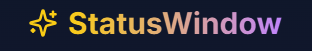

# StatusWindow

<p align="center">
  
</p>

<p align="center">
  A gamified self-improvement web application that turns your real-life activities into RPG-style progression.
</p>

<p align="center">
  <a href="#features">Features</a> •
  <a href="#demo">Demo</a> •
  <a href="#tech-stack">Tech Stack</a> •
  <a href="#architecture">Architecture</a> •
  <a href="#installation">Installation</a> •
  <a href="#usage">Usage</a> •
  <a href="#mobile-optimization">Mobile Optimization</a> •
  <a href="#future-development">Future Development</a>
</p>

## Features

StatusWindow transforms your daily activities into a gamified experience with:

- **Character Creation & Progression**: Create your character and level up as you complete real-life activities
- **Activity Logging System**: Log your daily activities and earn XP and stat points
- **Quest System**: Complete quests to earn rewards and track your progress
- **Inventory & Items**: Collect items as you progress through your journey
- **Progress Analytics**: Track your progress with detailed charts and statistics
- **Mobile-Optimized Experience**: Fully responsive design with touch gestures and mobile-specific features

## Demo

<p align="center">
  
  <em>Main Dashboard with Status Window and Activity Log</em>
</p>

<p align="center">
  
  <em>Character Creation Interface</em>
</p>

<p align="center">
  
  <em>Quest Board with Active and Completed Quests</em>
</p>

<p align="center">
  
  <em>Mobile-Optimized Interface</em>
</p>

## Tech Stack

StatusWindow is built with modern web technologies:

- **Frontend Framework**: Next.js 14 (App Router)
- **UI Library**: React 18
- **Styling**: Tailwind CSS with custom animations
- **State Management**: React Context API
- **Data Persistence**: Browser localStorage
- **Animations**: CSS animations, Framer Motion
- **Icons**: Lucide React
- **Charts**: Recharts
- **Particle Effects**: tsParticles

## Architecture

### Project Structure

```
statuswindow/
├── app/                      # Next.js App Router
│   ├── activities/           # Activities page
│   ├── dashboard/            # Main dashboard
│   ├── login/                # Login page
│   ├── onboarding/           # Character creation
│   ├── profile/              # User profile
│   ├── progress/             # Progress analytics
│   ├── quests/               # Quest board
│   ├── globals.css           # Global styles
│   ├── layout.tsx            # Root layout
│   ├── page.tsx              # Landing page
│   └── status-animations.css # Animation styles
├── components/               # React components
│   ├── ui/                   # UI components (shadcn/ui)
│   ├── activity-form.tsx     # Activity logging form
│   ├── activity-verification.tsx # Activity verification
│   ├── avatar-upload.tsx     # Avatar upload component
│   ├── celebration-effect.tsx # XP gain celebration
│   ├── inventory-system.tsx  # Inventory management
│   ├── mobile-nav-drawer.tsx # Mobile navigation
│   ├── mobile-nav-wrapper.tsx # Mobile nav wrapper
│   ├── particles-background.tsx # Particle effects
│   ├── particles-wrapper.tsx # Particles wrapper
│   ├── progress-chart.tsx    # Progress visualization
│   ├── quest-board.tsx       # Quest display
│   ├── scroll-to-top.tsx     # Scroll to top button
│   └── status-window.tsx     # Main status display
├── hooks/                    # Custom React hooks
│   ├── use-mobile.tsx        # Mobile detection
│   └── use-swipe.tsx         # Swipe gesture detection
├── lib/                      # Utility libraries
│   └── quest-generator.tsx   # Quest generation logic
├── public/                   # Static assets
│   ├── sfx/                  # Sound effects
│   ├── textures/             # Texture images
│   └── images/               # Images and icons
├── utils/                    # Utility functions
│   └── audio.ts              # Audio playback utilities
└── next.config.js            # Next.js configuration
```

### Core Components

- **StatusWindow**: Displays character stats, level, and progress
- **ActivityForm**: Interface for logging completed activities
- **QuestBoard**: Displays available and completed quests
- **ProgressChart**: Visualizes progress over time
- **InventorySystem**: Manages collected items and rewards

### Data Flow

1. User logs an activity through the ActivityForm
2. ActivityVerification confirms the activity's completion
3. XP and stats are calculated and added to the user's profile
4. StatusWindow updates to reflect new stats
5. Progress is saved to localStorage
6. CelebrationEffect provides visual feedback
7. Quest progress is updated if applicable

## Installation

```bash
# Clone the repository
git clone https://github.com/yourusername/statuswindow.git

# Navigate to the project directory
cd statuswindow

# Install dependencies
npm install

# Start the development server
npm run dev
