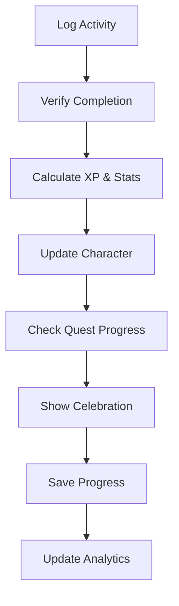

# StatusWindow

<p align="center">
  
</p>

<p align="center">
  <strong>Experience your own manga-style status window - Track your real-world progression like a manhwa protagonist</strong>
</p>

<p align="center">
  
  
  
  
</p>

<p align="center">
  <a href="https://statuswindow.vercel.app/" target="_blank">
    
  </a>
  <a href="#getting-started">
    
  </a>
  <a href="#features">
    
  </a>
</p>

---

## 🎮 What is StatusWindow?

StatusWindow brings the iconic blue status windows from manga and manhwa into real life. Just like protagonists who can see their stats, skills, and progression through mystical interfaces, you can now track your real-world growth with that same aesthetic. Complete activities, gain experience, and watch your abilities improve through a beautifully designed status system inspired by your favorite webtoons.

> **⚠️ Developer Note**: This is a passion project built by a beginner developer with the help of Vercel v0. The entire site is "vibe-coded" - meaning it prioritizes the aesthetic and feel over perfect functionality. Expect some bugs and quirks as this is very much a work in progress!

**🎯 Perfect for**: Manga/manhwa fans, goal-oriented individuals, productivity enthusiasts, anyone who's ever wanted their own status window interface.

---

## ✨ Key Features

<table>
<tr>
<td width="50%">

### 🏛️ **Core Status System**
- **Character Progression**: Level up through real activities like a manhwa hero
- **Stat Tracking**: STR, INT, CHA, and more based on your actions  
- **XP & Skills**: Earn experience points and unlock new abilities
- **Status Interface**: Classic blue window design inspired by popular webtoons

</td>
<td width="50%">

### 📱 **Modern Experience**
- **🌐 Browser-Based**: All data stored locally in your browser (no cloud storage)
- **📱 Responsive Layout**: Adapts from phone to ultra-wide displays  
- **⚡ Fast Loading**: Built with Next.js for smooth performance
- **🎨 Vibe-First Design**: Prioritizes aesthetic and manga-inspired feel

</td>
</tr>
<tr>
<td>

### 🎯 **Quest & Achievement System**
- **System Notifications**: Get manga-style notifications for completed tasks
- **Progress Tracking**: Visual progress bars like status windows in manhwa
- **Skill Unlocks**: Discover new abilities as you progress
- **Achievement Alerts**: Receive system messages for milestones

</td>
<td>

### 📊 **Analytics & Insights**
- **Progress Charts**: Visualize your growth over time
- **Activity Analytics**: Detailed breakdowns of your habits
- **Streak Tracking**: Maintain consistency with streak counters
- **Goal Setting**: Set and track personal objectives

</td>
</tr>
</table>

---

## 🖼️ Screenshots & Demo

<div align="center">

### 🏠 Main Dashboard


*Your personal status window with real-time stats, activity notifications, and skill progression*

</div>

<details>
<summary><strong>📱 View More Screenshots</strong></summary>

<div align="center">

### ⚔️ Character Creation


*Create your avatar with unique traits and stat distributions like awakening your abilities*

### 📜 Quest Board


*Track daily challenges with system notifications and skill rewards*

### 📱 Mobile Experience


*Optimized mobile interface with touch-friendly controls*

</div>

</details>

---

## 🚀 Getting Started

### ⚠️ Important Notes Before You Start

**Current Limitations:**
- 🐛 **Beta Status**: This is a work-in-progress with known bugs and incomplete features
- 💾 **Local Storage Only**: All your data is stored in your browser - clearing browser data will reset your progress
- 🌐 **No Offline Mode**: Despite being browser-based, offline functionality isn't implemented yet
- 🔰 **Beginner Project**: Built by a learning developer - code quality may vary!

### Quick Start (Recommended)

**Try it instantly**: Visit [statuswindow.vercel.app](https://statuswindow.vercel.app/) - no installation required!

### Local Development

```bash
# Clone the repository
git clone https://github.com/Deratheone/statuswindow.git
cd statuswindow

# Install dependencies
npm install

# Start development server
npm run dev
```

Open [http://localhost:3000](http://localhost:3000) in your browser.

### 🎮 First-Time Setup

1. **Awaken Your Status Window**
   - Choose your initial abilities and traits
   - Distribute your starting stat points
   - Customize your status interface

2. **Set Up Activities**
   - Define your activity categories (Exercise, Study, Work, etc.)
   - Configure XP values for different activities
   - Set daily goals and targets

3. **Begin Your Journey**
   - Log your first activity to gain XP
   - Receive your first system notification
   - Watch your stats grow in real-time!

---

## 🛠️ Tech Stack & Development

<table>
<tr>
<td><strong>Framework</strong></td>
<td>Next.js 14 (App Router)</td>
</tr>
<tr>
<td><strong>Frontend</strong></td>
<td>React 18, TypeScript</td>
</tr>
<tr>
<td><strong>Styling</strong></td>
<td>Tailwind CSS, Framer Motion</td>
</tr>
<tr>
<td><strong>State Management</strong></td>
<td>React Context API, localStorage</td>
</tr>
<tr>
<td><strong>Charts & Visualizations</strong></td>
<td>Recharts, Custom animations</td>
</tr>
<tr>
<td><strong>Icons & UI</strong></td>
<td>Lucide React, shadcn/ui</td>
</tr>
<tr>
<td><strong>Effects</strong></td>
<td>tsParticles, Custom particle systems</td>
</tr>
<tr>
<td><strong>Development Approach</strong></td>
<td>Built with Vercel v0 + manual coding</td>
</tr>
</table>

### 💭 Development Philosophy

This project follows a **"vibe-first"** development approach:
- ✨ **Aesthetic over perfection** - prioritizing the manga/manhwa feel
- 🎨 **Visual appeal first** - making it look cool before making it perfect
- 🔰 **Learning by doing** - built by a beginner, for beginners
- 🤝 **AI-assisted development** - leveraging Vercel v0 for rapid prototyping

---

## 🏗️ Project Architecture

```
statuswindow/
├── 📁 app/                    # Next.js App Router
│   ├── 🎯 dashboard/          # Main dashboard
│   ├── 🏗️ onboarding/        # Character creation
│   ├── 📊 progress/           # Analytics & charts
│   ├── 📜 quests/             # Quest management
│   └── 🎨 globals.css         # Global styles
├── 📁 components/             # Reusable components
│   ├── 🎮 status-window.tsx   # Main character display
│   ├── 📝 activity-form.tsx   # Activity logging
│   ├── 🎊 celebration-effect.tsx # XP celebrations
│   └── 📱 mobile-nav-*.tsx    # Mobile navigation
├── 📁 hooks/                  # Custom React hooks
│   ├── 📱 use-mobile.tsx      # Mobile detection
│   └── 👆 use-swipe.tsx       # Touch gestures
├── 📁 lib/                    # Business logic
│   └── 🎯 quest-generator.tsx # Quest creation
└── 📁 utils/                  # Helper functions
    └── 🔊 audio.ts            # Sound effects
```

---

## 🎯 How It Works



1. **Activity Logging**: User logs completed real-world activities
2. **XP Calculation**: System calculates experience points and stat gains
3. **Status Update**: Stats update with manhwa-style notifications
4. **Skill Progress**: Related abilities and skills advance automatically  
5. **System Alerts**: Blue window notifications show gains and achievements
6. **Data Persistence**: Progress saves locally for offline access
7. **Analytics Update**: Charts and insights refresh with new data

---

## 📱 Mobile Optimization & Current State

StatusWindow is built with mobile responsiveness in mind, though with some limitations:

### ✅ What Works Well
- **🎯 Touch-First Design**: Large tap targets for mobile users
- **📱 Responsive Layout**: Adapts to different screen sizes
- **⚡ Fast Loading**: Optimized for mobile performance  

### ⚠️ Known Issues & Limitations
- **📶 No True Offline Support**: App needs internet despite local data storage
- **💾 Browser Dependency**: All progress tied to specific browser/device
- **🐛 Mobile Bugs**: Some features may not work perfectly on all devices
- **🔄 No Cross-Device Sync**: Can't access your progress from different devices

---

## 🗺️ Roadmap

### 🎯 Current Focus (v1.1)
- [ ] **Bug Fixes** - Addressing known issues and improving stability
- [ ] **True Offline Support** - Making the app work without internet
- [ ] **Data Backup** - Export/import functionality for user data
- [ ] **Cross-Device Sync** - Cloud storage option for progress

### 🚀 Future Vision (v2.0+)
- [ ] **PWA Support** - Install as mobile app
- [ ] **System Notifications** - Enhanced manga-style alerts
- [ ] **Skill Trees** - Unlock abilities through progression  
- [ ] **Cloud Storage** - Optional account system for data sync
- [ ] **Mobile Apps** - Native iOS and Android versions

---

## 🤝 Contributing

StatusWindow is a beginner-friendly project that welcomes contributions! Whether you're also learning or an experienced developer, your help is appreciated.

### 🐛 Bug Reports & Feedback
Since this is a learning project with known issues:
- [Report bugs](https://github.com/Deratheone/statuswindow/issues) - help identify problems!
- [Share feedback](https://github.com/Deratheone/statuswindow/discussions) - suggest improvements
- [Request features](https://github.com/Deratheone/statuswindow/issues) - what would make it better?

### 💻 Development Contributions

Perfect for fellow beginners or anyone who wants to help improve the codebase:

```bash
# 1. Fork the repository
# 2. Create a feature branch
git checkout -b fix/some-bug

# 3. Make your changes (big or small!)
# 4. Test on both desktop and mobile
npm run build && npm run start

# 5. Commit with clear messages
git commit -m "fix: resolve mobile navigation issue"

# 6. Push and create PR
git push origin fix/some-bug
```

### 🎓 Learning Together
- **Beginner-friendly**: Don't worry about perfect code - we're all learning!
- **Code quality**: Any improvement is welcome, no matter how small
- **Documentation**: Help make the README or comments clearer
- **Testing**: Help identify and fix mobile/browser compatibility issues

---

## 📄 License

This project is licensed under the **MIT License** - see the [LICENSE](LICENSE) file for details.

---

## 🙋‍♂️ Support & Community

<p align="center">
  <a href="https://github.com/Deratheone/statuswindow/issues">
    
  </a>
  <a href="https://github.com/Deratheone/statuswindow/discussions">
    
  </a>
  <a href="https://statuswindow.vercel.app/">
    
  </a>
</p>

### 📞 Get Help & Report Issues
- **🐛 Bug Reports**: [GitHub Issues](https://github.com/Deratheone/statuswindow/issues) - found a bug? Let me know!
- **💡 Feature Ideas**: [GitHub Discussions](https://github.com/Deratheone/statuswindow/discussions) - suggest improvements
- **❓ Questions**: [GitHub Discussions Q&A](https://github.com/Deratheone/statuswindow/discussions/categories/q-a) - ask anything!
- **⚠️ Data Loss**: If you lose progress, unfortunately it can't be recovered (browser storage only)

---

<div align="center">

### ⭐ Star this repo if you found it helpful!

**StatusWindow** - *A beginner's manga-inspired passion project*

Made with ❤️ and lots of trial & error by a learning developer (with help from Vercel v0)

<a href="#statuswindow">↑ Back to Top</a>

</div>
